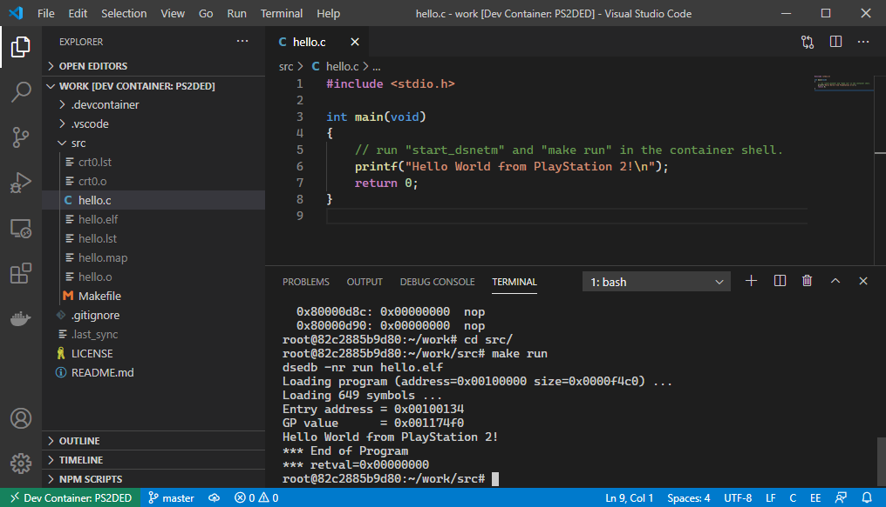

# PlayStation 2 DevEnv for Docker &ndash; VS Code Template

Template project repository for developing PlayStation 2 applications using Visual Studio Code. Requires one of the following toolchain host containers:

* [**`ps2ded-oss`**](https://github.com/islandcontroller/ps2ded-oss) for use with the Open Source PlayStation 2 SDK
* [**`ps2ded-sce`**](https://github.com/islandcontroller/ps2ded-sce) for use with the Sony PlayStation 2 SDK

The devcontainer is configured for running on a Windows host (workaround applied).

## Configuration

Before running this container, edit the configuration files in `.devcontainer` to match your setup, i.e. match the `PS2IP` with your target's IP address, and select the PS2DED image variant.

| File                | Setting                                        |
|---------------------|------------------------------------------------|
| `devcontainer.json` | Edit `PS2IP` env variable to match your target |
| `Dockerfile`        | Select one of the PS2DED variants              |

## Usage 

1. Open the repo folder in VS Code
2. *Remote Explorer* tab, select *Containers* in the combo box
3. Click on "reopen the current folder in a container"
4. Select cpptools configuration (EE or IOP) for your SDK in the lower right corner

**Demo for Sony SDK:** if using the Sony SDK, run the Makefile in the `src` subdirectory.

    start_dsnetm
    cd src
    make run

**Demo for open-source SDK:** if using the open-source SDK, copy the "cube" sample into the working directory. Run the Makefile to build the ELF-executable, and upload it to the target using `dsedb`.

    cp -r $PS2SDK/samples/draw/cube .
    cd cube
    make all
    start_dsnetm
    dsedb -nr run cube.elf